# Client Portal CRM

A multi-tenant CRM SaaS for freelancers and small agencies — every account is an **Organization** with its own team (staff members with roles), its own Clients/Projects/Tasks/Invoices, its own billing subscription, and an optional **Client Portal** its clients can log into directly. Built with Next.js App Router, Prisma, and Supabase.

> A complete, tested multi-tenant SaaS foundation: real multi-tenancy, real Paddle billing (buyer supplies their own account/credentials — see [Billing](#billing)), a Client Portal, attachments, comments, notifications, onboarding, analytics, search, and a Platform Admin console — all built on Server Components and Server Actions with no client-side data-fetching library.

## Live demo

**[client-portal-crm.vercel.app](https://client-portal-crm.vercel.app)**

Staff demo credentials (Owner):

| | |
|---|---|
| Email | `demo@clientportal.dev` |
| Password | `DemoPassword123!` |

A second staff account (`demo2@clientportal.dev`, same password) is a plain **Member** of the same organization — sign in as either to see the same shared workspace, with the Team page showing both.

Client Portal demo credentials (a real, separate portal-only identity, invited into one of the demo clients):

| | |
|---|---|
| Email | `portal-demo@clientportal.dev` |
| Password | `DemoPassword123!` |

All three accounts are seeded via `npm run db:seed` (`prisma/seed.ts`, see [Database setup](#database-setup-prisma)) into one already-connected demo organization — clients, projects, tasks, invoices, a couple of threaded comments (including an @-mention), and a couple of notifications, so every staff account lands directly on a populated dashboard, no extra setup step required. Attachments are deliberately not seeded: an Attachment row is a pointer to a real Supabase Storage object, and the seed script performs no Storage upload, so a fake row would just 404 — upload a real file through the app itself to see that flow.

These demo credentials are intentionally public — the seeded organization uses only fictional data (see [prisma/seed.ts](prisma/seed.ts)), but the account has full read/write access, so treat data in it as disposable and re-seedable, not as a stable fixture between sessions.

## Screenshots

| | |
|---|---|
| **Dashboard** — live metrics, revenue trends, and status breakdowns | **Clients** — search, filter, sort, pagination |
| 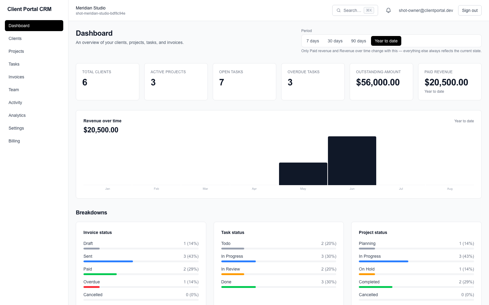 | 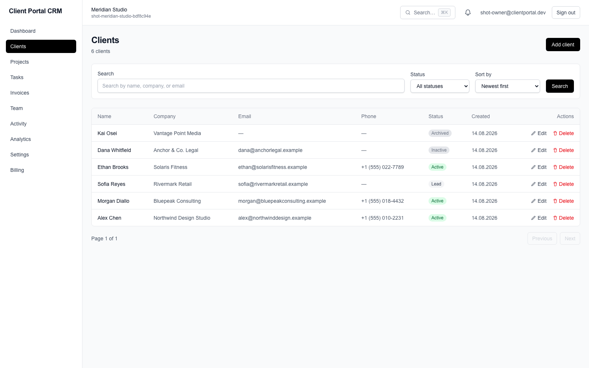 |
| **Projects** | **Tasks** |
| 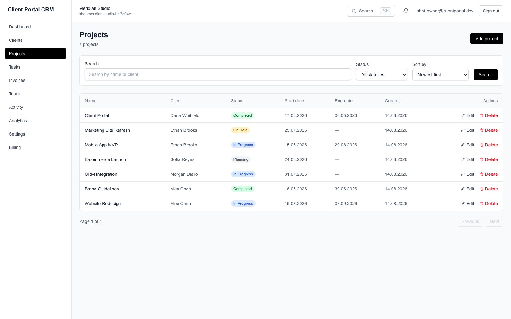 | 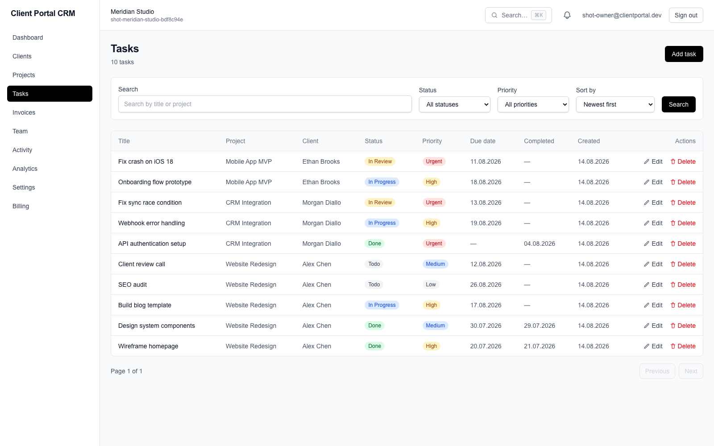 |
| **Invoices** | **Client Portal** — a client's own view of their invoices |
| 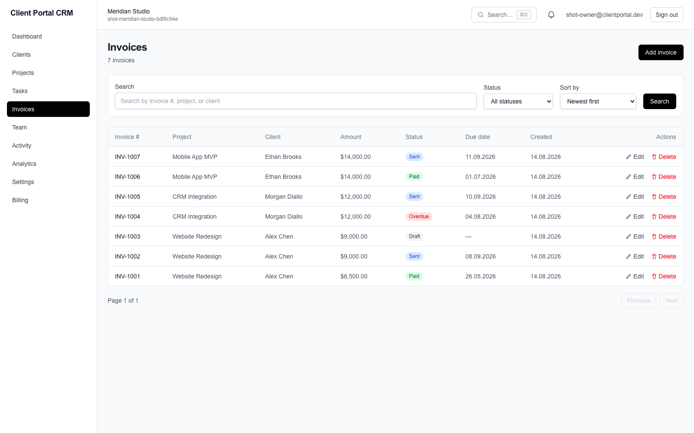 | 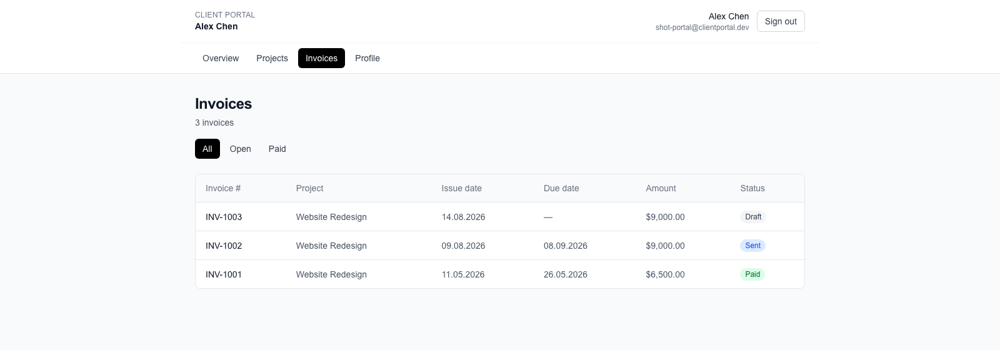 |
| **Client detail** — Client Portal access management | **Project collaboration** — threaded comments with @-mentions |
| 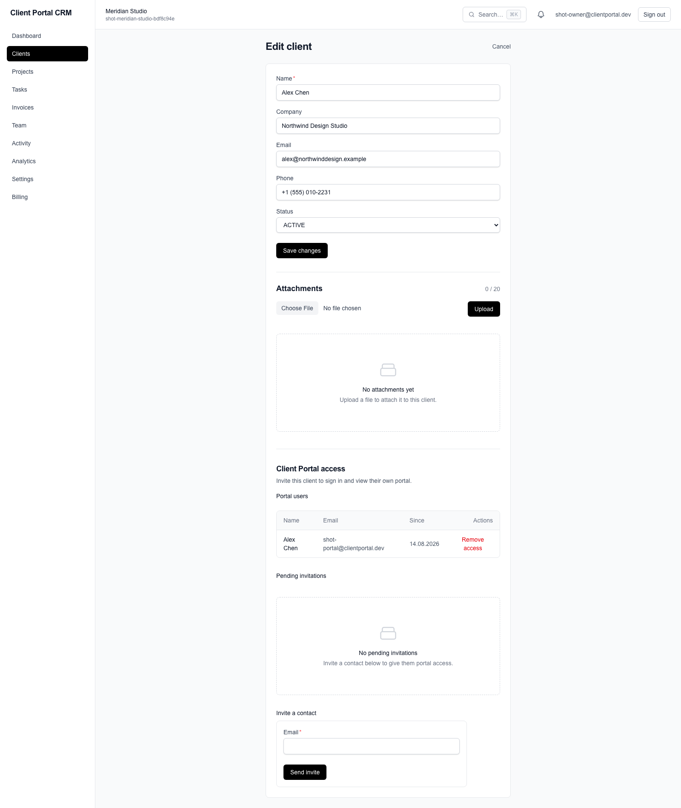 | 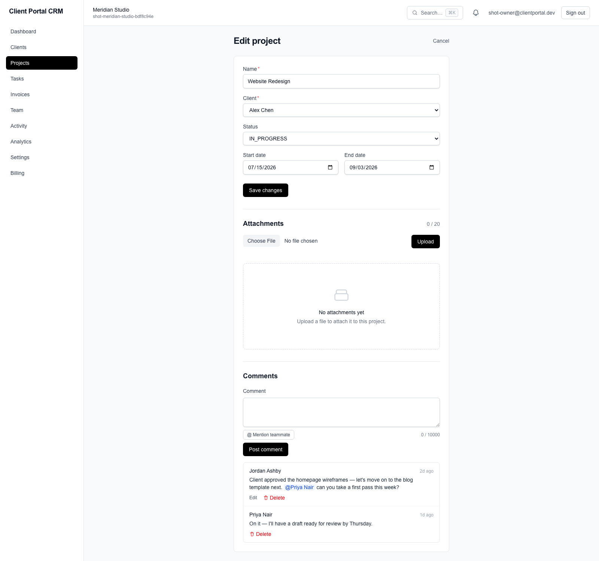 |
| **Analytics** — KPIs and trend charts derived entirely from the org's own data | **Team** — roles and membership |
| 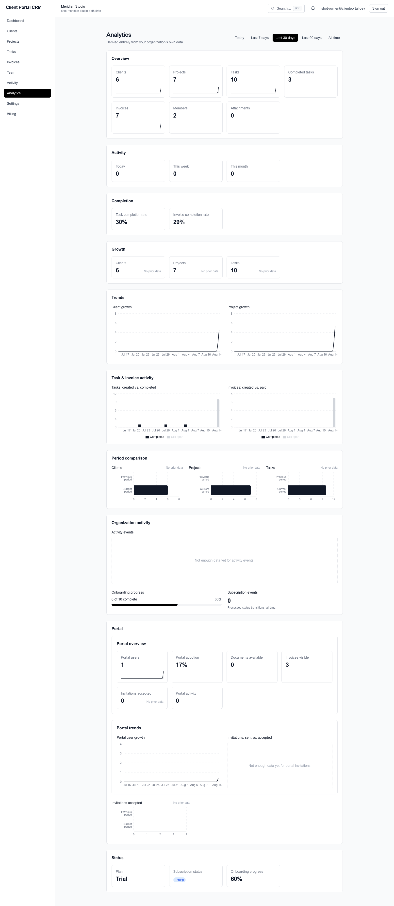 | 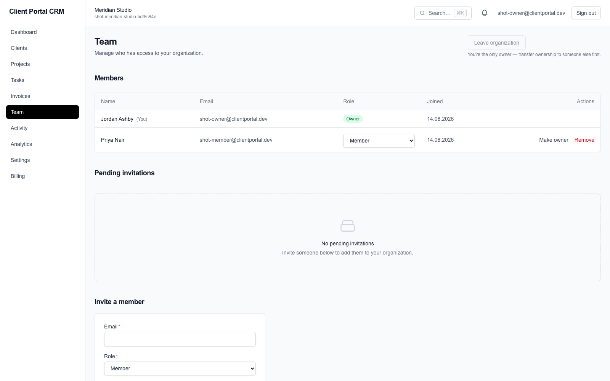 |
| **Billing settings** — plan, usage, and Paddle plans (buyer-configurable; intentionally unconfigured in this demo) | **Onboarding** — first-login "Getting started" checklist |
| 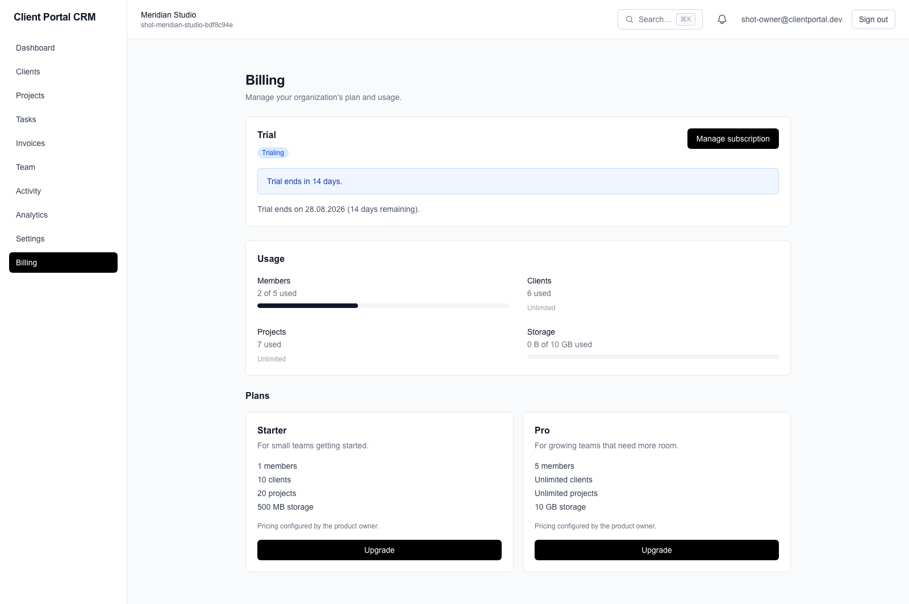 | 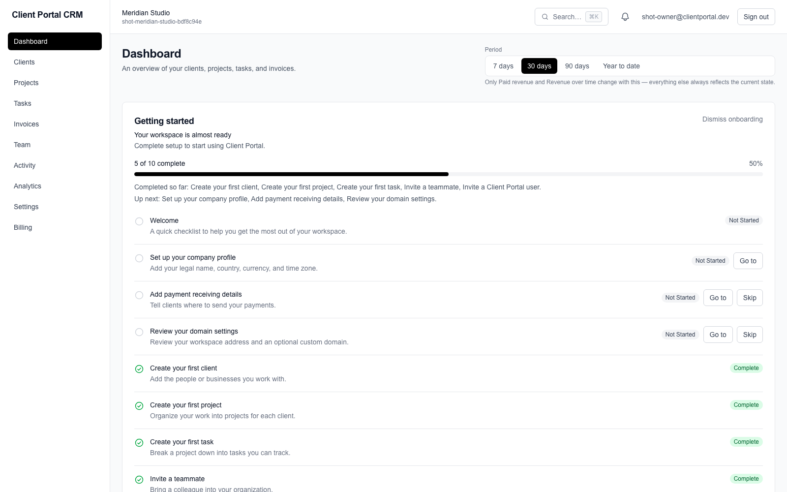 |

Also: [branded login](docs/images/login.png) · [Client Portal — Projects](docs/images/client-portal-projects.png)

## Features

- **Multi-tenant Organizations** — every account belongs to an `Organization`; staff join it via a `Membership` with a role (`OWNER` / `ADMIN` / `MEMBER`), enforced server-side on every sensitive mutation (team management, billing, etc.), never just in the UI.
- **Clients, Projects, Tasks, Invoices** — full CRUD for each, scoped to the active organization at the database query level.
- **Client Portal** (`/portal`) — a separate, thinner identity space (`PortalUser`, invited per-Client) where a client can log in to view their own projects and invoices — no access to staff data, no access to other clients.
- **Team & invitations** — invite staff by email (token-based, expiring, single-use), manage roles, invite clients to the portal the same way.
- **Attachments** — real file uploads (Supabase Storage) on clients/projects/tasks, with a server-validated type/size allowlist.
- **Comments** — threaded comments with @-mentions on projects.
- **Notifications** — in-app Notification Center + email digest/delivery (Resend), with graceful degradation when no email provider is configured.
- **Onboarding** — a dismissible "Getting started" checklist on first login, computed live from real data (no separate progress table beyond an explicit skip/dismiss).
- **Analytics** (`/analytics`, OWNER/ADMIN) — KPIs and trend charts derived entirely from the org's own data; no external analytics provider, no tracking.
- **Search** — cross-entity search across clients/projects/tasks/invoices/comments.
- **Billing & subscriptions** — plan catalog, usage-based entitlement enforcement, and a real, buyer-configurable Paddle integration (see [Billing](#billing)).
- **Platform Admin** (`/platform-admin`) — a read-only, env-var-gated internal console for whoever operates the deployment (see [Platform Admin](#platform-admin)) — separate from any tenant's own Organization.
- **Search, filter, sort, pagination** — server-side, URL-param-driven (`?q=&status=&sort=field:dir&page=`), so state survives a refresh and is shareable as a link.
- **Dashboard** — live metrics and recent-activity feeds, computed with concurrent Prisma queries.
- **Toast notifications, accessible confirmation dialogs, error boundaries** — small hand-built components, no UI/toast/icon library.
- **Seed script** — creates a working demo organization (real Supabase Auth users, not just database rows) with realistic sample data.

## Architecture

- **Rendering model**: every list/detail page is a Server Component. Data is fetched directly with Prisma inside the page — there is no client-side data-fetching layer (no SWR/React Query) and no global client state store.
- **Mutations**: all writes go through Next.js Server Actions (`"use server"` functions), colocated with the route that uses them (e.g. `app/(dashboard)/clients/new/actions.ts`). Forms use React's `useActionState` for pending/error state.
- **Auth**: Supabase Auth issues a session via cookies. `middleware.ts` refreshes that session on every request. Route protection happens in `app/(dashboard)/layout.tsx`, which redirects to `/login` if there's no session, and separately routes a Client Portal-only identity to `/portal` instead of the staff app.
- **Tenancy model**: every business row (`Client`/`Project`/`Task`/`Invoice`/`Attachment`/`Comment`/...) is scoped by `organizationId`. The active organization is resolved **server-side only** — `getCurrentUserOrganization()`/`getCurrentMembership()` (`src/lib/current-user.ts`) verify the authenticated user actually holds a `Membership` in that organization before any query runs; an org id is never trusted from client input. Role-gated actions (billing, team management) additionally check `membership.role`.
- **Client Portal identity**: a `PortalUser` is a structurally separate identity from staff `User`/`Membership` — it authenticates the same way (Supabase Auth) but has no Membership and no access to the staff app; it's scoped to exactly the `Client` it was invited for.
- **Platform Admin identity**: separate again from both — gated purely by an env-var email allowlist (`PLATFORM_ADMIN_EMAILS`), not a `Role` or `Membership`, since it's an operator-level concern that spans every organization (see [Platform Admin](#platform-admin)).
- **Auth-to-database identity**: `User.id`/`PortalUser.id` are set to the Supabase Auth user's UUID directly (no separate mapping table). `getOrCreateUser()` upserts the Prisma `User` row on first authenticated request.

## Tech stack

| Layer | Choice |
|---|---|
| Framework | Next.js 16 (App Router, Server Components, Server Actions) |
| Language | TypeScript |
| Styling | Tailwind CSS v4 |
| Database | PostgreSQL (via Supabase) |
| ORM | Prisma 7, with the `@prisma/adapter-pg` driver adapter |
| Auth | Supabase Auth (`@supabase/ssr`, cookie-based sessions) |
| File storage | Supabase Storage (attachments + org logos) |
| Email | Resend |
| Billing | Paddle (`@paddle/paddle-node-sdk` server-side, `@paddle/paddle-js` for checkout) — buyer-configurable, see [Billing](#billing) |
| Hosting target | Vercel |
| Seed runner | `tsx` (dev-only, runs `prisma/seed.ts`) |

No UI component library, no client-side state library, no toast library, no icon library — status badges, tables, dialogs, toasts, and icons are all small hand-built components under `src/components/ui`.

## Project structure

This is an illustrative subset — the app now spans many more domains (organizations/team, billing, notifications, attachments, comments, search, onboarding, platform admin) under the same conventions shown here. See `src/` for the complete tree.

```
prisma/
  schema.prisma            # data model
  migrations/               # applied migrations
  seed.ts                   # demo data (creates real Supabase auth users too)

src/
  app/
    (auth)/                 # /login, /signup — public
    (dashboard)/             # protected staff route group, shares one layout
      layout.tsx             # auth check + active-org resolution + Sidebar/Header shell
      dashboard/              # metrics + recent activity
      clients/, projects/, tasks/, invoices/
        page.tsx              # list: search/filter/sort/pagination
        query.ts               # param parsing + Prisma where/orderBy builder
        new/                    # create form + action
        [id]/edit/               # edit form + action
        actions.ts              # mutations
        loading.tsx             # route-level skeleton
      team/                    # invitations, roles
      settings/                # company, domain, notifications, payment, billing
    portal/                  # Client Portal — separate identity, separate layout
    (platform-admin)/        # operator-only console, env-var gated
    api/
      billing/webhook/        # Paddle webhook route
      cron/                    # notification delivery/cleanup
    billing/checkout/         # Paddle.js checkout bridge page

  components/
    ui/                      # Button, Input, Select, Table, StatusBadge, …
    billing/, platform-admin/, list/, layout/, toast/, dashboard/, …

  lib/
    prisma.ts                # Prisma client singleton (driver adapter)
    current-user.ts          # org/membership resolution — the tenancy boundary
    billing/                 # plans, entitlements, provider adapter, webhook logic
    storage/                 # Supabase Storage (attachments, logos)
    notifications/, email/, onboarding/, search/, platform-admin/, rate-limit/, ...

  types/index.ts             # shared form-state types

middleware.ts                 # calls updateSession on every request
```

## Setup

### Prerequisites

- Node.js 20+
- A [Supabase](https://supabase.com) project (free tier is enough)

### 1. Install dependencies

```bash
npm install
```

### 2. Configure environment variables

Copy the example file and fill in your own values (see [Environment variables](#environment-variables) below):

```bash
cp .env.example .env
```

### 3. Set up the database

Follow [Database setup](#database-setup-prisma) below to apply the schema (and optionally seed demo data).

### 4. Run the dev server

```bash
npm run dev
```

Visit [http://localhost:3000](http://localhost:3000).

## Buyer setup overview

If you're standing up your own deployment of this codebase, you supply your own infrastructure and billing configuration — nothing account-specific ships with this repository. At a glance, what you'll configure (details in `.env.example` and the docs linked from each row):

| Category | What you supply | Where |
|---|---|---|
| PostgreSQL / Supabase project | Your own Supabase project's connection strings | `.env.example` (`DATABASE_URL`/`DIRECT_URL`) |
| Supabase Auth | Nothing extra — works out of the box once the Supabase project + anon key are set | `.env.example` |
| Supabase Storage | Two buckets you create yourself in your Supabase project | [Storage setup](#storage-setup-supabase) below |
| Email (Resend) | Your own Resend API key + sender domain (optional — app degrades gracefully without it) | `.env.example` |
| Vercel | Your own project/deployment | `.env.example`, [Deployment](#deployment-vercel) |
| `CRON_SECRET` | A random secret you generate | `.env.example` |
| Platform Admin | Your own email address(es), added to an env var | [Platform Admin](#platform-admin) below |
| Billing (Paddle) | Your **own** Paddle account, API key, webhook secret, price IDs, client-side token | [Billing](#billing) below, [`docs/billing-provider-adapter.md`](docs/billing-provider-adapter.md) |

**This repository contains no Paddle account, no real API keys/secrets/price IDs, no KYC/KYB, and no payout/banking information** — the current maintainer of this codebase has not created a Paddle account or entered any billing credentials. All of that is created and entered by whoever deploys their own instance, with zero application code changes required.

## Environment variables

Full detail (including exactly where to find each value and what happens if an optional one is left unset) lives in `.env.example` — copy it to `.env` and fill in your own values; no real values are shown here.

| Category | Variables | Notes |
|---|---|---|
| Database | `DATABASE_URL`, `DIRECT_URL` | Supabase connection strings — pooled vs. direct, see below |
| Supabase | `NEXT_PUBLIC_SUPABASE_URL`, `NEXT_PUBLIC_SUPABASE_ANON_KEY`, `SUPABASE_SERVICE_ROLE_KEY` | Service role key is server-only — used for seeding and Storage |
| Email | `RESEND_API_KEY`, `INVITATION_FROM_EMAIL` | Optional — invitations fall back to a copyable link if unset |
| App | `APP_BASE_URL`, `CRON_SECRET` | Base URL for email links; secret required by the two cron routes |
| Platform branding/legal | `PLATFORM_NAME`, `PLATFORM_TAGLINE`, `PLATFORM_LOGO_URL`, `PLATFORM_FAVICON_URL`, `PLATFORM_LEGAL_NAME`, `PLATFORM_LEGAL_ADDRESS`, `PLATFORM_SUPPORT_EMAIL`, `PLATFORM_JURISDICTION`, `PLATFORM_BILLING_EMAIL`, `PLATFORM_REPLY_TO_EMAIL` | All optional, white-label the product's own identity/legal pages |
| Platform Admin | `PLATFORM_ADMIN_EMAILS` | Comma-separated allowlist — see [Platform Admin](#platform-admin) |
| Billing (Paddle) | `BILLING_PROVIDER`, `BILLING_ENVIRONMENT`, `BILLING_API_KEY`, `BILLING_WEBHOOK_SECRET`, `BILLING_STARTER_PRICE_ID`, `BILLING_PRO_PRICE_ID`, `NEXT_PUBLIC_BILLING_CLIENT_TOKEN` | See [Billing](#billing) below |

`DATABASE_URL` uses the pgbouncer transaction pooler because it's what the deployed app talks to under serverless/edge concurrency. `DIRECT_URL` bypasses the pooler because schema migrations need a session-scoped connection — this split is configured in `prisma.config.ts` (CLI operations use `DIRECT_URL`) and `src/lib/prisma.ts` (the app's runtime client uses `DATABASE_URL`).

## Storage setup (Supabase)

Two Supabase Storage buckets must exist in your own Supabase project before file uploads work — this app never creates them automatically (`getStorageAdminClient()` only connects to Storage, it never provisions a bucket):

| Bucket name | Visibility | Used for | Limits |
|---|---|---|---|
| `attachments` | **Private** | Client/Project/Task attachments — accessed only via short-lived (60s) signed URLs, never a public link | 10 MB/file, 20 files per entity, allowlisted types (PDF, PNG/JPEG/WebP, TXT/CSV, DOC/DOCX/XLS/XLSX — no SVG/HTML/executables/archives) |
| `logos` | **Public** | Organization logos — rendered directly via a permanent public URL | 2 MB/file, PNG/JPEG/WebP only |

To create them: in your Supabase project, go to **Storage** → **New bucket**, create `attachments` (leave it private) and `logos` (mark it public), using those exact names. No Storage RLS policies are required — both buckets are accessed exclusively through a server-side service-role client (`SUPABASE_SERVICE_ROLE_KEY`), which bypasses Storage RLS entirely; that key is never sent to the browser.

## Platform Admin

`/platform-admin` is a read-only console for whoever *operates* this deployment (not a tenant/customer concern) — organization/user lookups and a read-only view of platform-level configuration.

Access is controlled entirely by one env var, **`PLATFORM_ADMIN_EMAILS`** (`src/lib/platform-admin/authorization.ts`): a comma-separated, case-insensitive list of Supabase Auth email addresses. To get access yourself:

1. Sign up for a normal account in the app (any email you control) — this creates your Supabase Auth user.
2. Add that same email to `PLATFORM_ADMIN_EMAILS` in your deployment's environment variables (e.g. `PLATFORM_ADMIN_EMAILS="you@example.com,teammate@example.com"`).
3. Redeploy — this is a build/runtime env var, not something the app can pick up without a new deployment.
4. Visit `/platform-admin` while signed in with that email.

Unset (the default) means nobody has access — an unauthenticated request to `/platform-admin/*` redirects to `/login` (the normal sign-in redirect every protected route uses), and a signed-in but non-matching email redirects silently to `/dashboard`, never revealing that the route exists. This grants access across every organization on the deployment, so keep the list to people who should actually operate the platform — never a tenant's own `Role`/`Membership`.

## Database setup (Prisma)

The full data model lives in `prisma/schema.prisma` — Organizations/Memberships/Invitations, Clients/Projects/Tasks/Invoices, the Client Portal (`PortalUser`), Attachments, Comments, Notifications, Billing (`Subscription`/`WebhookEvent`), and Onboarding — versioned as SQL migrations under `prisma/migrations/`.

1. **Apply the schema** to your database (non-interactive, safe for a fresh database or CI):

   ```bash
   npx prisma migrate deploy
   ```

2. **(Optional) Seed demo data.** Requires `SUPABASE_SERVICE_ROLE_KEY` to be set — the seed script (`prisma/seed.ts`) creates three real Supabase Auth accounts (two staff, one Client Portal contact — see [Live demo](#live-demo) above for credentials), a real Organization with both staff accounts as Members of it, and fills it with realistic clients, projects, tasks, invoices, comments, and notifications — already connected, so the very first login lands on a populated dashboard rather than an empty workspace:

   ```bash
   npm run db:seed
   ```

   This prints the demo login credentials (email + password) to the console.

3. **(Optional) Browse the database** with Prisma Studio:

   ```bash
   npx prisma studio
   ```

During active development, use `npx prisma migrate dev` instead of `migrate deploy` when you change `schema.prisma` — it creates a new migration file and applies it in one step.

## Deployment (Vercel)

1. Push the repo to GitHub.
2. Import it in Vercel.
3. Add the environment variables above in Vercel's Project Settings → Environment Variables (Paddle variables only once you're ready to enable real billing — see [Billing](#billing); everything else as needed).
4. Vercel runs `next build` automatically. Make sure migrations have already been applied to the target database (`npx prisma migrate deploy`, run locally against the production `DIRECT_URL` or via a CI step) — the build does not run migrations for you.
5. Create the two Supabase Storage buckets in your production project (see [Storage setup](#storage-setup-supabase)) — attachment/logo uploads will fail until this is done.
6. Deploy.

No further configuration is needed — there's no separate backend to deploy; Server Actions run as part of the Next.js deployment itself.

### Background jobs (Vercel Cron)

Two scheduled jobs, defined in `vercel.json`, retry failed notification
emails and clean up old read notifications — see
`docs/notifications-architecture.md`'s cron section for the full retry/
cleanup policy. Both are gated by `CRON_SECRET` (`src/lib/cron/auth.ts`);
Vercel automatically sends it as `Authorization: Bearer <CRON_SECRET>` on
every scheduled invocation once the env var is set in Project Settings —
no extra configuration needed beyond adding that one variable.

**Vercel plan note**: this project assumes a **Hobby** plan, which caps
Cron Jobs at once per day *per job*. Both jobs below are scheduled daily
as a result — the delivery retry job's ideal cadence (every 15–30
minutes) needs a **Pro** plan or higher; if you're on Pro, tighten
`vercel.json`'s schedule for `/api/cron/notification-delivery` accordingly.

## Security approach

- **Every query is tenant-scoped.** Reads and writes filter by `organizationId` (directly or via a relation), resolved server-side only (`getCurrentUserOrganization()`/`getCurrentMembership()`) — never trusted from client input. Delete/update operations use Prisma's `updateMany`/`deleteMany` with a compound `{ id, organizationId }`-style `where`, since Prisma's unique-`where` `update()`/`delete()` can't express "this id, but only if it's mine" in one atomic query.
- **404, not a permission error, on cross-tenant access.** Trying to open another organization's record by guessing its id returns the same `notFound()` response as a record that doesn't exist at all.
- **Foreign keys are always re-verified server-side.** A create/edit form's `<select>` only ever lists the active organization's own clients/projects, but that's a UI convenience, not the security boundary — every action independently re-checks ownership before writing.
- **Role-gated actions check the role server-side.** Team management and billing actions verify `membership.role` on every call, not just in the UI.
- **Three structurally separate identities.** Staff (`User`/`Membership`), Client Portal (`PortalUser`), and Platform Admin (email allowlist) never share a resolution path — a Client Portal identity can never reach the staff app or another client's data; Platform Admin can never be granted via a tenant's own `Role`.
- **The service-role key never reaches the browser.** It's used server-only, for seeding demo data and for the Supabase Storage admin client. Application code otherwise only ever uses the anon key + session cookies.
- **CLI vs. runtime connections are separated.** Prisma CLI operations (migrate, seed) use a direct, non-pooled connection (`DIRECT_URL`); the deployed app uses the pooled connection (`DATABASE_URL`) — configured once in `prisma.config.ts`.
- **No public Supabase Data API access.** A migration revokes `anon`/`authenticated` privileges on every table in the `public` schema — the app talks to Postgres exclusively through Prisma, not PostgREST.
- **Hardened session cookies.** Supabase session cookies are written with one shared `cookieOptions` config, applied at every `createServerClient(...)` call site — `npm run security:check` flags any call site missing it.
- **HTTP security headers on every response.** `next.config.ts` sets a Content-Security-Policy, `X-Frame-Options: DENY`, `X-Content-Type-Options: nosniff`, `Referrer-Policy`, and a restrictive `Permissions-Policy`, applied to every route including API routes.
- **Application-level rate limiting.** Sensitive actions (invitations, attachment downloads, billing actions, the webhook route, etc.) are rate-limited in-process (`src/lib/rate-limit`), independent of any platform-level limiting.
- **Billing webhook trust boundary.** `POST /api/billing/webhook` verifies the provider signature before parsing anything, validates the claimed organization against the database before applying an event, and dedupes via a real database unique constraint — never a check-then-insert race.
- **100+ automated security checks** (`npm run security:check`) run in CI on every PR, covering tenant isolation, the billing/webhook boundary, TEST_MODE isolation, cron auth, secret handling, and more (see `scripts/security-checks/`).

## Testing

Three layers — unit (pure logic), integration (real Prisma against a real
PGlite-backed Postgres), and E2E (real Chromium against a real production
build) — plus a set of static security checks. See
[`docs/testing.md`](docs/testing.md) for the full architecture, how to run
each layer locally and in CI, what's deliberately not covered at the E2E
layer and why, and the TEST_MODE identity/Storage bypass E2E relies on
(and how it's verified to never affect a real deployment).

## CI

GitHub Actions (`.github/workflows/`) run on every pull request:

- **`ci-fast.yml`** — `prisma validate`, type-check, lint, build, static security checks, unit tests.
- **`ci-integration.yml`** — integration tests, then a production build and the Playwright E2E suite.

Both are intended to be green before merging a pull request.

## Scripts

| Command | Description |
|---|---|
| `npm run dev` | Start the dev server |
| `npm run build` | Production build |
| `npm run start` | Run the production build |
| `npm run lint` | ESLint |
| `npm run db:seed` | Seed demo data (see [Database setup](#database-setup-prisma)) |
| `npx prisma migrate dev` | Create/apply a migration in development |
| `npx prisma migrate deploy` | Apply pending migrations (production-safe, non-interactive) |
| `npx prisma studio` | Browse the database |
| `npm test` | Unit + integration tests |
| `npm run test:unit` | Unit tests (Vitest) |
| `npm run test:integration` | Integration tests against a real PGlite-backed Postgres |
| `npm run test:e2e` | Playwright E2E — run `npm run build` first (see [`docs/testing.md`](docs/testing.md)) |
| `npm run security:check` | Static security checks (`scripts/security-checks/`) |

## Roadmap

Ideas for future iterations — not required for the product to work today:

- **Custom domain verification.** Settings → Domain lets an organization save a custom domain, but real DNS verification isn't implemented yet — a saved domain stays in a "pending" state indefinitely. This is intentional and disclosed in the UI itself, not a bug.
- **Trial-ending reminders / billing reconciliation.** See [Billing](#billing) below — both are optional, defense-in-depth additions, not required for correctness.
- **Invoice PDF export / email delivery** — invoices currently exist only as database records with a status field; there's no PDF generation or send-by-email flow.

## Billing

A full, real, **buyer-configurable** Paddle billing integration — see [`docs/billing-architecture.md`](docs/billing-architecture.md) for the original design and [`docs/billing-provider-adapter.md`](docs/billing-provider-adapter.md) for the adapter contract, exact env vars, and the sandbox → live checklist.

**What's implemented and working today:**
- A typed plan catalog, organization entitlements, and server-side limit enforcement on staff invites, Client/Project creation, and Attachment uploads.
- A staff-only Billing page (`/settings/billing`) — current plan, status, usage, Starter/Pro plan cards.
- A real Paddle adapter (`@paddle/paddle-node-sdk` server-side, `@paddle/paddle-js` for the checkout overlay) — real checkout, real Customer Portal, real signature-verified/idempotent webhook processing (`POST /api/billing/webhook`) that updates `Subscription` and notifies the org's OWNER.
- **The provider registry activates this real adapter automatically** once a complete, valid Paddle configuration (all six server-only env vars + the client-side token) is present — no application code changes needed. Missing/partial/invalid configuration fails closed to a clearly-labeled "not configured" state; `TEST_MODE` (used only by this repo's own E2E suite, never in a real deployment) always takes priority over a real Paddle config if both happen to be present.
- A full, deterministic **mock provider**, active only when `TEST_MODE=1`, exercising the entire pipeline end to end with zero network calls and zero payment data collected — this is test infrastructure, not something a real deployment ever uses.

**What you supply as the buyer:** your own Paddle account (sandbox first, then live), API key, webhook secret, Starter/Pro price IDs, and Paddle client-side token — see the env var table above and `docs/billing-provider-adapter.md`'s checklist for the exact steps, including Paddle's own domain-approval requirement. **This repository contains none of that** — no Paddle account has been created, and no real credentials, KYC/KYB, or payout information exist here; that's entirely your own setup with Paddle directly.

**Deliberately not built (optional, not required for correctness):** trial-ending email reminders and a billing-reconciliation cron job — both are defense-in-depth additions a real deployment can add later if desired; the webhook pipeline is already idempotent and correctly ordered without them.

**Not yet validated against a real Paddle account:** the checkout/webhook code has been built and tested against Paddle's own current, real API/documentation and a fully mocked SDK client, but has never been exercised against an actual Paddle sandbox delivery (since no Paddle account exists in this repository's own development). Recommended first step once you have a sandbox account: a real end-to-end checkout and webhook delivery test.

## Onboarding

A dismissible "Getting started" checklist — see
[`docs/onboarding-architecture.md`](docs/onboarding-architecture.md): a
minimal `OrganizationOnboardingStep` table (only for the two things that
can't be derived from real data — an explicit skip and an explicit
dismiss), a pure progress-computation engine that reads live
Client/Project/Task/Membership/PortalUser data, and skip/acknowledge/
finish Server Actions. A dismissible "Getting started" card renders at
the top of `/dashboard` (never a wizard, modal, or blocking overlay)
showing a progress bar and a per-step checklist with "Go to"/"Skip"
actions; it disappears once every substantive step is done or skipped,
or once explicitly dismissed. No settings entry point or resume
mechanism exists yet (deliberately deferred).

One step, **"Review billing,"** points at the real `/settings/billing` page (see [Billing](#billing) above) — every staff role can view it, and it renders safely with no Paddle account configured at all, so reviewing billing never requires setting it up.

The Client Portal side is deliberately separate and much thinner: a
one-time "Welcome to your client portal" banner on `/portal` for a
newly-accepted `PortalUser` (eligibility inferred from `createdAt`, no
new table or column), with a non-persisted "Got it" dismiss and two
CTAs (View projects / View invoices). No checklist, no steps, no shared
state with the staff onboarding system above.

## Analytics

A staff-only Analytics dashboard (`/analytics`, OWNER/ADMIN only) — see
[`docs/analytics-architecture.md`](docs/analytics-architecture.md): KPI
cards (clients, projects, tasks, invoices, members, attachments,
completion rates), trend charts (client/project growth, task and
invoice activity, portal growth) built on Recharts, and a URL-driven
time range selector (today / 7 / 30 / 90 days / all time). A dedicated
Portal analytics section reuses the same chart components. Everything
is derived from this app's own real business data — no external
analytics provider, no tracking cookies, no telemetry. Two portal
metrics ("recent logins", "document download count") were deliberately
not implemented, since neither has a real data source in the current
schema — see the architecture doc's own §12 for the full reasoning.

## License

Portfolio project — no license specified.
